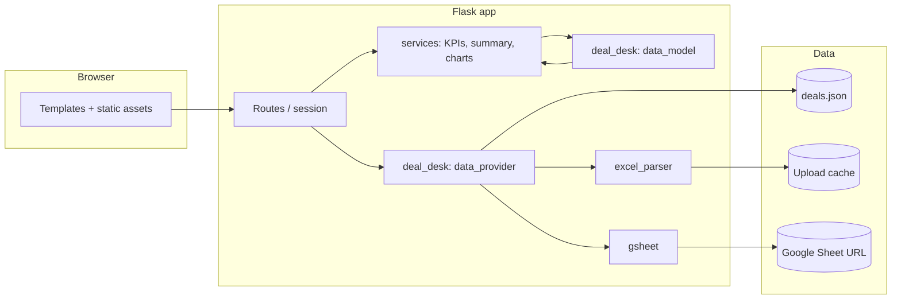

# Deal Desk · Take Rate Analytics (Flask)

A self-contained **Flask** dashboard for **US & Canada (US&C) take rate and P&L analytics**. It mirrors the metrics, filters, summary table, and interactive charts from the Streamlit-based **Deal Desk** experience, using a Python port of the same data model so numbers stay aligned with other tooling for identical inputs.

---

## Table of contents

- [Why this project exists](#why-this-project-exists)
- [Features](#features)
- [Architecture](#architecture)
- [Requirements](#requirements)
- [Quick start](#quick-start)
- [Configuration](#configuration)
- [Data sources](#data-sources)
- [Excel and Google Sheet formats](#excel-and-google-sheet-formats)
- [How the app is organized](#how-the-app-is-organized)
- [HTTP routes](#http-routes)
- [Deployment and path prefixes](#deployment-and-path-prefixes)
- [Troubleshooting](#troubleshooting)
- [Publishing the repository](#publishing-the-repository)

---

## Why this project exists

- **Dedicated web stack**: Run the Deal Desk analytics as a standard Flask app (WSGI, reverse proxies, session cookies) without the Streamlit runtime.
- **Parity with existing logic**: The `deal_desk` package implements the same field names and formulas as the shared TypeScript `dataModel` (ported 1:1), so KPIs and tables match other dashboards for the same dataset.
- **Flexible data**: Ship with curated **demo JSON**, accept **Excel uploads**, or point at a **public Google Sheet** URL for refreshable extracts.

---

## Features

| Area | What you get |
|------|----------------|
| **Dashboard** | US&C analytics at `/usc` — KPI strip, filter chips, **Summary** tab (P&L-style table), **Viz** tab (Plotly charts). |
| **Filters** | Date range (by month), merchant type, segment, market (territory), fulfillment (All / CPP / MPP). Apply, clear, persisted in session. |
| **Themes** | **Light** and **dark** UI (palette aligned with the Streamlit USC styling). |
| **Data modes** | **Demo** (`data/deals.json`), **file upload** (`.xlsx`, in-memory cache per session key), **Google Sheet** (HTTP fetch + TTL cache). |
| **Landing** | Home page with regional entry; **US & Canada** is the full analytics path. Stub pages for LATAM / EMEA / APAC. |

---

## Architecture

High-level flow:



- **`deal_desk/data_model.py`**: Normalization, filters, `compute_metrics`, store-level alignment with deal filters.
- **`deal_desk/data_provider.py`**: `Dataset`, demo load, upload bytes, Google Sheet with `DatasetCache` (uploads + TTL for sheets).
- **`deal_desk/excel_parser.py`**: Workbook parsing with header **alias** scoring to detect deals vs stores sheets.
- **`deal_desk/gsheet.py`**: Fetches published CSV or XLSX export URLs; normalizes like uploads.
- **`services/`**: HTML fragments for KPI rows, summary table, and Plotly chart divs consumed by Jinja templates.

---

## Requirements

- **Python 3.10+** recommended (as used with current dependencies).
- Dependencies are pinned loosely in `requirements.txt`:

  - `flask` — web app and sessions  
  - `pandas` — tabular data and aggregations  
  - `plotly` — charts  
  - `openpyxl` — `.xlsx` read  
  - `requests` — Google Sheet HTTP fetch  
  - `python-dotenv` — optional `.env` loading  

---

## Quick start

```bash
cd deal-desk-flask
python3 -m venv .venv
source .venv/bin/activate   # Windows: .venv\Scripts\activate
pip install -r requirements.txt
cp .env.example .env        # optional; see Configuration
python app.py
```

Open **http://127.0.0.1:5000/** in your browser, then choose **US & Canada** to open the full dashboard (`/usc`).

For development-style auto-reload and tracebacks:

```bash
export FLASK_DEBUG=1
python app.py
```

Default bind: **host `0.0.0.0`**, **port `5000`** (override with `PORT`).

---

## Configuration

Environment variables (see `.env.example`):

| Variable | Purpose | Default |
|----------|---------|---------|
| `SECRET_KEY` | Flask session signing key. **Set in production.** | Dev placeholder in code |
| `PORT` | Listen port | `5000` |
| `FLASK_DEBUG` | Set to `1` for debug server | off |
| `GSHEET_TTL_SECONDS` | Cache duration for repeated Google Sheet URL fetches | `300` |

Load order: `python-dotenv` loads `.env` when present. **Do not commit `.env`** (it is gitignored).

---

## Data sources

### 1. Demo (bundled)

Default mode loads `data/deals.json` (deals + stores). Useful for demos and UI development without external files.

### 2. Excel upload

- **Max upload size**: 80 MB (Flask `MAX_CONTENT_LENGTH`).
- Upload an `.xlsx` workbook; the parser discovers **deals** and **stores** sheets by matching column headers to known aliases (see below).
- Uploaded datasets are stored in an **in-memory** cache keyed by a random session value; restarting the server clears them.

### 3. Google Sheet

- Paste a **public** URL:
  - **Publish to web** CSV for a single sheet, or  
  - An `/export?format=xlsx` style URL for a full workbook (same parsing path as upload).
- Responses are cached per URL for `GSHEET_TTL_SECONDS` to avoid hammering the link on every request.
- The sheet must be reachable anonymously over HTTPS (no OAuth in this app).

If the sheet URL fails or returns invalid data, the app falls back to **demo** mode and surfaces a **flash error** on the next dashboard load.

---

## Excel and Google Sheet formats

### Deals sheet

The parser maps common export header names to canonical columns (examples):

- **Dimensions**: `date`, `merchant_type`, `merchant_segment`, `grouped_parent_name`, `territory`, `Vertical`
- **Measures**: `trips`, `basket`, `gross_bookings`, fees, payments, promotions, revenue lines, variable costs, etc.

Aliases include friendly names such as `orders` → `trips`, `gmv` / `subtotal` → `basket`, `deliveryfee` → `booking_fees`, and many others. See `DEAL_ALIASES` in `deal_desk/excel_parser.py` for the full list.

### Stores sheet

Expected concepts: `accounting_date`, `merchant_type`, `merchant_segment`, `territory`, `active_stores`, `store_level`, `Vertical`, `Region`. Again, multiple header spellings are accepted (`STORE_ALIASES`).

Missing numeric columns are treated as zero; missing string columns as empty. The data model then applies **fulfillment** rules (CPP vs MPP) consistent with the TypeScript reference.

---

## How the app is organized

| Path | Role |
|------|------|
| `app.py` | Flask application factory, routes, session-backed dataset mode and filters |
| `deal_desk/` | Core analytics: `data_model`, `excel_parser`, `gsheet`, `data_provider` |
| `services/` | Presentation helpers: `kpis`, `summary`, `charts`, `filters` |
| `templates/` | Jinja2: `base.html`, `index.html`, `usc.html`, region stubs, partials |
| `static/` | CSS and vendor assets |
| `data/deals.json` | Bundled demo dataset |
| `scripts/publish-github.sh` | Optional headless GitHub publish helper |

---

## HTTP routes

| Route | Method | Description |
|-------|--------|-------------|
| `/` | GET | Landing / navigation |
| `/region/<slug>` | GET | Placeholder pages (`latam`, `emea`, `apac`) |
| `/usc` | GET | Main dashboard (tab `summary` \| `viz`, dim query params optional) |
| `/usc/apply` | POST | Apply filters (form) |
| `/usc/clear` | POST | Reset filters to "all" |
| `/usc/theme` | POST | Toggle light/dark theme |
| `/usc/data` | POST | Data actions: `reset`, `gsheet`, `upload` (multipart file) |

Static files are served from `/static/...`.

---

## Deployment and path prefixes

This app is designed to work behind gateways that mount it under a **session-specific path prefix** (for example, some corporate or notebook proxies). Templates use a **root-relative** URL helper (`rel_for`) and `base.html` derives a `<base href>` from `window.location` so links, forms, and assets resolve correctly **without** the server needing to know the external prefix. Relative redirects (e.g. back to `../usc` after POST) preserve that prefix in the browser.

For production:

- Set a strong `SECRET_KEY`.
- Run behind a production WSGI server (e.g. Gunicorn, uWSGI) with appropriate worker and timeout settings for large uploads.
- Terminate TLS at your reverse proxy.

---

## Troubleshooting

| Symptom | Things to check |
|---------|------------------|
| Google Sheet always shows demo | URL must be publicly readable; check flash error on dashboard. Verify CSV/XLSX export link. |
| Upload fails or empty metrics | Confirm workbook has detectable deals (and optionally stores) sheets and headers match aliases. Try exporting with clearer column names from `DEAL_ALIASES` / `STORE_ALIASES`. |
| Stale sheet numbers | Lower or raise `GSHEET_TTL_SECONDS`, or use **Reset** data action and re-enter URL. |
| Session lost on restart | Expected: Flask default sessions are signed cookies; large data lives in server memory (upload cache). |
| Port already in use | `export PORT=5001` (or another free port) before `python app.py`. |

---

## Publishing the repository

Instructions for creating the GitHub remote and pushing (CLI, HTTPS, SSH, and scripted PAT flow) live in **[PUBLISHING.md](./PUBLISHING.md)**.

---

## Related work

This repository is intentionally **separate** from a Streamlit-based Deal Desk (`deal-desk-streamlit` or similar). Use this project when you want a conventional Flask + Jinja + static front end with the same underlying take-rate logic.
